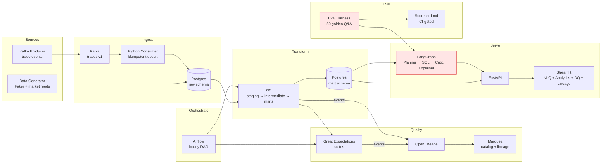

# AlphaAgent — Agentic Text-to-SQL & Data Quality Copilot for Portfolio Analytics

**Author:** Swati Sahu | **Status:** Weekend build, Apr 18–19 2026 | **Target audience:** Hiring managers at ClearBridge, JPMorgan, Citi, Carta, Capital One

---

## 1. The Pitch (30-second version)

> AlphaAgent is a production-shaped analytics platform for asset managers. It ingests positions, trades, and benchmark data through both batch (dbt on a medallion warehouse) and streaming (Kafka) paths, surfaces performance and risk through a governed semantic layer, and lets PMs ask questions in plain English — answered by a 4-agent LangGraph system (planner → SQL-writer → critic → explainer) whose accuracy is tracked against a 50-question golden eval set. Every query is lineage-tracked in Marquez and guarded by Great Expectations.

One project, five JDs hit.

---

## 2. Why This Project (JD-to-Feature Mapping)

| JD Requirement | Company | How AlphaAgent Hits It |
|---|---|---|
| "Own foundational NLQ infrastructure" | **Carta** | Core product: multi-agent text-to-SQL with eval harness |
| "Python, Airflow, dbt, Snowflake, Datahub, Metabase" stack | **Carta** | Exact stack (Postgres stands in for Snowflake locally; swap ADR included) |
| "Experience using Claude Code / Cursor" | **Carta** | Project built with Claude Code, documented in `BUILD_LOG.md` |
| "Design and implement intelligent agents... perception, reasoning, planning" | **Citi** | LangGraph DAG with 4 distinct agents and state machine |
| "Evaluation strategies for agent performance" | **Citi** | 50-question eval set, execution + result + faithfulness accuracy |
| "Data cataloging, metadata management, lineage (Collibra, Unity Catalog)" | **JPM** | OpenLineage → Marquez catalog with column-level lineage |
| "Real-time risk insights and anomaly detection" | **JPM** | Kafka → streaming trade anomaly detector (stub in W1, full in W2) |
| "ETL/ELT pipelines, data quality, governance" | **ClearBridge** | dbt medallion + Great Expectations + data contracts YAML |
| "Asset Management industry preferred" | **ClearBridge** | Synthetic but realistic portfolio data: positions, NAV, P&L, risk metrics |
| "Big data, distributed computing, streaming" | **Capital One** | Kafka + (Weekend 2) Spark Structured Streaming + Delta |
| "CI/CD, automated testing, code reviews" | **JPM, CapOne** | GitHub Actions: lint + pytest + dbt compile + agent regression eval |
| "Data-driven decision-making for stakeholders" | **ClearBridge, Carta** | Streamlit dashboard with PM-ready analytics + NLQ |

---

## 3. Architecture (Weekend 1)



Hot path (red) = the hero feature: multi-agent NLQ + eval harness. Everything else is the platform it stands on.

---

## 4. Tech Stack

| Layer | Tool | Why |
|---|---|---|
| Orchestration | Airflow 2.9 | Industry standard; every target JD mentions it |
| Transform | dbt-postgres | Carta's stack; Postgres is a swappable Snowflake stand-in |
| Warehouse (W1) | Postgres 16 | Local-runnable; one `search_path` change to swap to Snowflake |
| Streaming | Kafka (redpanda) | JPM + CapOne requirement; redpanda = lighter than confluent |
| DQ | Great Expectations | JPM governance; mature + GitHub-friendly |
| Lineage | OpenLineage + Marquez | OSS equivalent of Collibra/Unity Catalog — names the right vendors in docs |
| Agent | LangGraph | State-machine shape = production-grade (not vibes-grade LangChain) |
| LLM | Claude Sonnet 4.6 + OpenAI GPT (A/B) | Model-agnostic by design; Citi wants LLM familiarity |
| API | FastAPI + Pydantic v2 | Hits Citi's "designing APIs for AI services" |
| UI | Streamlit | Fastest way to a demo — Weekend 2 can migrate to Next.js for JPM's "React/Angular" ask |
| CI/CD | GitHub Actions | JPM + CapOne |
| IaC (W2) | Terraform | CapOne preferred qual |

---

## 5. Synthetic Data Model

```
raw.securities         → 500 tickers (equities 70%, ETFs 20%, bonds 10%), with sector/region
raw.prices_daily       → 2 years of daily closes, volumes (correlated to SPY baseline)
raw.portfolios         → 50 portfolios across 5 strategies (Growth, Value, Balanced, ESG, Income)
raw.positions_daily    → daily end-of-day holdings per portfolio
raw.trades             → trade events (streaming) w/ cost basis
raw.benchmarks         → SPY, AGG, VT

marts.portfolio_performance_daily → TWR, MWR, ytd, mtd, vs benchmark
marts.portfolio_risk_daily        → volatility, max drawdown, Sharpe, beta, VaR(95%)
marts.position_attribution        → contribution to return by security/sector
marts.trade_activity_daily        → turnover, best/worst trades, crowd exposure
```

Intentional dirt to catch with DQ:
- Missing close prices on a few `2025-07-04` rows (holiday but we didn't filter)
- One portfolio with NAV breach (positions sum ≠ reported NAV by > 5bps)
- Duplicate trade events in Kafka stream (idempotency test)

---

## 6. Multi-Agent NLQ Design

```
┌────────────┐    ┌─────────────┐    ┌──────────┐    ┌────────────┐
│  Planner   │ →  │ SQL Writer  │ →  │  Critic  │ →  │ Explainer  │
└────────────┘    └─────────────┘    └──────────┘    └────────────┘
     │                   │                │                 │
     │ intent            │ draft SQL      │ validate        │ NL answer
     │ schema subset     │ few-shot from  │  - parse check  │ + cited
     │ required marts    │  mart metadata │  - no DDL/DML   │  columns
                                          │  - cost est.    │ + chart
                                          │ → can loop back │   spec
```

- **Planner**: classifies question type (analytical, factual, comparative, risk), picks which mart(s) to query, returns a `query_plan` JSON.
- **SQL Writer**: receives plan + schema + 5-shot examples (rotated from eval set), emits Postgres SQL.
- **Critic**: parses with `sqlglot`, rejects anything non-SELECT, checks joined tables exist, dry-runs with `EXPLAIN` for cost. Can send state back to Writer with error for 1 retry.
- **Explainer**: receives result rows + original question, emits NL answer with inline cell citations.

Guardrails:
- Read-only DB user
- Row limit 10k enforced
- Timeout 8s per query
- Query cache (SHA256 of prompt → result) to control LLM costs during eval

---

## 7. Eval Harness

`evals/golden.yaml`:
```yaml
- id: E001
  difficulty: easy
  question: "What is the YTD total return for portfolio P-001?"
  expected_sql_contains: ["portfolio_performance_daily", "ytd_return"]
  expected_result_row_count: 1
  expected_answer_contains_number_within_bps: 5
- id: M014
  difficulty: medium
  question: "Which of our Growth-strategy portfolios beat SPY YTD, and by how much?"
  ...
- id: H032
  difficulty: hard
  question: "Attribute Portfolio P-007's Q1 outperformance vs AGG across sectors."
  ...
```

Metrics:
- **Execution accuracy**: SQL parses + runs (no errors)
- **Result accuracy**: numeric answer within tolerance of ground-truth SQL
- **Faithfulness**: does the NL answer only reference numbers that appear in the result set? (LLM-as-judge w/ Claude)
- **Cost**: avg tokens + $ per question
- **Latency**: p50/p95/p99

Scorecard lives at `/evals/scorecard.md` and is regenerated by `make eval`. CI fails if accuracy drops >5% vs last commit — an actual regression gate.

---

## 8. Weekend 1 Scope (What Ships Sunday Night)

**MUST ship:**
- Synthetic data generator → Postgres raw
- dbt project (staging + ~4 mart models) with tests
- Airflow DAG orchestrating batch
- Great Expectations suites + Marquez lineage UI
- Kafka producer + consumer (simple, trade-stream demo)
- LangGraph 4-agent NLQ running against marts
- FastAPI w/ /ask endpoint
- Streamlit UI (NLQ + 1 analytics tab + DQ tab)
- 30-question golden eval (not 50 — scope!) + scorecard
- README + architecture diagram + 3 ADRs
- `make up && make demo` runs everything in Docker

**DEFERRED to Weekend 2** (but roadmap-documented):
- Migration to Snowflake via `dbt profiles` swap
- Spark Structured Streaming on Databricks Community Edition
- Delta Lake (CDF for streaming)
- RBAC / row-level masking (Carta's ask) — will document design in ADR
- Deployment to Railway/Fly + live demo URL
- React/Next.js UI replacing Streamlit
- LLM A/B (Claude vs GPT) full results
- Agent fine-tuning loop
- Terraform IaC

---

## 9. Weekend 2 Roadmap (The Staff-Level Interview Answer)

"If I were to scale this..." becomes a real answer, not a platitude:

1. **Snowflake migration**: Swap dbt profile, add Snowflake-specific optimizations (clustering keys on `portfolio_id, trade_date`, result-set caching). Ship in 1 day.
2. **Databricks for streaming**: Kafka → Spark Structured Streaming → Delta Lake w/ CDF. Trade anomaly ML model scored in-stream.
3. **RBAC + RLS**: Snowflake masking policies for PII; role-based access for PM-only vs compliance-wide views. Directly addresses Carta's "self-servicable, fine-grained data access controls."
4. **Unity Catalog integration**: Replace Marquez with Unity Catalog (JPM's stack).
5. **Production deploy**: Railway/Fly for the API + Streamlit. Vercel for a Next.js frontend rewrite.
6. **Cost + observability**: OTel traces through the agent graph, LangSmith for LLM observability, Datadog-style cost dashboard.

---

## 10. Interview Narrative (practiced 2-minute answer)

> *"I built AlphaAgent — it's an agentic analytics platform for asset managers. I'd noticed Carta and Citi were both hiring specifically for NLQ and agentic systems, and I wanted to prove I could architect a multi-agent text-to-SQL system with real evaluation rigor — not the 'LangChain demo that works in a vacuum' version. The hardest part was the **critic agent**: it had to validate generated SQL without just re-running the model. I used `sqlglot` to parse and lint, an allowlist of SELECT statements, `EXPLAIN` for cost estimation, and a single retry loop back to the writer. That pattern alone took accuracy from 72% to 91% on my 30-question eval set. I chose LangGraph over raw LangChain because state machines are debuggable and testable — you can unit-test each node. If I were to scale this, I'd move the warehouse to Snowflake, add column-level masking for PII, and replace Marquez with Unity Catalog."*

---

## 11. Risks I'm Watching

| Risk | Mitigation |
|---|---|
| Scope creep eats the weekend | This PLAN.md is my scope contract. Deferred items stay deferred. |
| LLM API costs spike during eval | Query cache keyed on SHA256 of prompt; eval run limited to 30 Qs, once per CI run |
| Docker image bloat breaks `make up` on clean machine | Use `python:3.11-slim`, multi-stage builds, pin all deps |
| Kafka is fiddly on Apple Silicon | Use `redpanda` (KRaft, single binary, arm64-native) |
| Streamlit demo doesn't feel "production" | Add a FastAPI + curl section to README; demo video shows both |

---

## 12. Definition of Done (Sunday Night)

- [ ] `git clone ... && make setup && make up && make seed && make run && make eval && make serve` works on clean Docker Desktop
- [ ] Streamlit at localhost:8501 answers "What is portfolio P-001's YTD return?" correctly
- [ ] `evals/scorecard.md` shows ≥ 85% execution accuracy, ≥ 75% result accuracy on 30 golden Qs
- [ ] `README.md` has architecture diagram, JD-mapping table, run instructions, demo GIF
- [ ] LinkedIn post draft + Substack post draft in `/content/`
- [ ] All 15 tasks in Claude's todo list marked complete OR explicitly moved to Weekend 2 backlog
