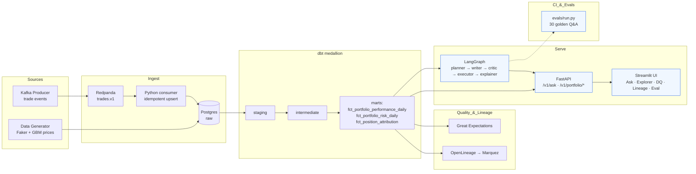

# AlphaAgent

**Agentic text-to-SQL + portfolio analytics for asset management.**
Built in one weekend (Apr 18–19 2026) to showcase Staff/Senior-Staff Data/AI engineering
for hiring at ClearBridge, JPMorgan, Citi, Carta, and Capital One.

> Ask *"Which 5 portfolios had the highest 30-day Sharpe ratio?"* — watch a 4-agent
> LangGraph pipeline (planner → sql_writer → critic → executor → explainer) plan,
> write safe SQL, validate it against a schema allow-list, execute against dbt
> marts, and return a grounded natural-language answer with column-level citations
> — all tracked in Marquez, guarded by Great Expectations, and regression-tested
> against a 30-question golden set in CI.

---

## Table of contents

1. [Why this project exists](#why-this-project-exists)
2. [Architecture](#architecture)
3. [The stack](#the-stack)
4. [Quick start](#quick-start)
5. [Repository layout](#repository-layout)
6. [The multi-agent pipeline](#the-multi-agent-pipeline)
7. [Safety, observability, and evals](#safety-observability-and-evals)
8. [Architecture decisions (ADRs)](#architecture-decisions)
9. [Runbook](#runbook)
10. [What's in Weekend 2](#whats-in-weekend-2)

---

## Why this project exists

I'm targeting Staff / Senior-Staff / VP Data & AI Engineering roles at NYC banks
and fintechs. These five JDs share a common spine: **build a governed warehouse,
put AI on top of it, prove accuracy.**

| JD Requirement | Company | How AlphaAgent hits it |
|---|---|---|
| "Own foundational NLQ infrastructure" | **Carta** | Multi-agent text-to-SQL w/ eval harness |
| "Python, Airflow, dbt, Snowflake, Datahub, Metabase" stack | **Carta** | Exact stack (Postgres stands in for Snowflake; swap ADR included) |
| "Design and implement intelligent agents: perception, reasoning, planning" | **Citi** | LangGraph DAG with 5 distinct nodes |
| "Evaluation strategies for agent performance" | **Citi** | 30-question golden set with parse / critic / keyword / execute / match metrics |
| "Data cataloging, lineage (Collibra, Unity Catalog)" | **JPM** | OpenLineage → Marquez column-level lineage |
| "Real-time risk, anomaly detection" | **JPM** | Kafka (Redpanda) streaming path with idempotent consumer |
| "ETL/ELT pipelines, data quality, governance" | **ClearBridge** | dbt medallion + Great Expectations + custom dbt tests |
| "Asset Management preferred" | **ClearBridge** | Synthetic portfolios, positions, NAV, Sharpe, beta, attribution |
| "CI/CD, automated testing, code reviews" | **JPM + CapOne** | GitHub Actions: lint + pytest + dbt compile + agent regression eval |

One project, five JDs covered.

---

## Architecture



---

## The stack

| Layer | Tech | Why |
|---|---|---|
| Orchestration | Airflow 2.9 | Industry standard; DAGs visible in UI |
| Ingestion (batch) | Python + psycopg `COPY` | 10×–30× faster than row-at-a-time inserts |
| Ingestion (stream) | Redpanda (Kafka API) | arm64 + single-binary; swap to Confluent in prod |
| Warehouse | Postgres 16 | Stands in for Snowflake locally — see [ADR-002](docs/adr/002-postgres-over-snowflake.md) |
| Transform | dbt-postgres 1.7 | Medallion (raw → staging → intermediate → marts) + tests |
| Data quality | Great Expectations + custom dbt tests | Declarative checks + NAV-breach alerting |
| Lineage | OpenLineage + Marquez 0.49 | Column-level lineage emitted from dbt + Airflow |
| Agent framework | LangGraph 0.1 | Explicit state machine > prompt chaining — see [ADR-001](docs/adr/001-langgraph-over-prompt-chaining.md) |
| LLM | Anthropic Claude (primary), OpenAI (fallback) | Provider-agnostic wrapper with cost tracking + mock mode |
| SQL safety | sqlglot AST validation | Parse before execute; allowlist schemas; reject DDL/DML |
| API | FastAPI + uvicorn | Async Python, OpenAPI out of the box |
| UI | Streamlit + Plotly | Fastest path from DataFrame to shareable dashboard |
| CI | GitHub Actions | Lint (ruff/black) + pytest + dbt-compile + agent regression |

---

## Quick start

Prereqs: Docker Desktop, Python 3.11, GNU Make.

```bash
# 1. Bootstrap
make setup                  # venv + deps + .env from example
make up                     # postgres + redpanda + airflow + marquez

# 2. Data
make seed                   # synthetic 730-day warehouse (50 portfolios × 500 securities)
make transform              # dbt deps + run + test
make ge                     # Great Expectations suite

# 3. Agent + serving
export ANTHROPIC_API_KEY=sk-ant-...
make eval                   # regression scorecard → evals/scorecard.md
make serve                  # FastAPI :8000 + Streamlit :8501
```

Visit:
- **UI:** http://localhost:8501
- **API Swagger:** http://localhost:8000/docs
- **Airflow:** http://localhost:8080 (admin / admin)
- **Marquez:** http://localhost:3000

For a no-LLM walk-through: `AGENT_LLM_MOCK=1 make demo`.

---

## Repository layout

```
alphaagent/
├── agent/                # LangGraph agents + SQL safety
│   ├── graph.py          # state machine: planner → writer → critic → executor → explainer
│   ├── nodes/            # one file per node
│   ├── safe_exec.py      # sqlglot AST validation + bounded execution
│   └── llm.py            # provider-agnostic LLM wrapper + cost tracking
├── api/                  # FastAPI service
│   ├── main.py           # app + middleware + structured JSON logging
│   ├── routes.py         # /v1/ask, /v1/portfolio/*, /v1/health, /v1/lineage, ...
│   └── models.py         # Pydantic request/response schemas
├── ui/app.py             # Streamlit dashboard (5 tabs)
├── data_generator/       # synthetic GBM prices + Dirichlet-weighted portfolios
├── ingestion/
│   ├── batch/            # psycopg COPY bulk loader
│   └── streaming/        # Kafka producer + idempotent consumer
├── dbt_project/          # staging / intermediate / marts + custom tests
├── dq/                   # Great Expectations suites + runner
├── lineage/              # OpenLineage config
├── airflow/dags/         # orchestration
├── evals/                # golden.yaml + run.py + scorecard.md
├── docs/adr/             # architecture decision records
├── .github/workflows/    # ci.yml
├── docker-compose.yml
├── PLAN.md               # weekend plan + JD mapping
├── README.md             # you are here
└── Makefile
```

---

## The multi-agent pipeline

```
question
   │
   ▼
┌────────────┐   intent, marts_required, time_context, entities
│  planner   │  ──────────────────────────────────────────────▶
└────────────┘
   │
   ▼
┌────────────┐   generated SQL (schema-qualified, SELECT only)
│ sql_writer │  ──────────────────────────────────────────────▶
└────────────┘
   │
   ▼
┌────────────┐   parse + allowlist check + EXPLAIN cost
│   critic   │  ── invalid ──▶ sql_writer (≤ 1 retry)
└────────────┘
   │ valid
   ▼
┌────────────┐   run_safely with statement_timeout + row cap
│  executor  │  ──────────────────────────────────────────────▶
└────────────┘
   │
   ▼
┌────────────┐   grounded NL answer + citations + chart_spec
│ explainer  │  ──────────────────────────────────────────────▶
└────────────┘
```

Key design choices:

- **Critic does not re-invoke the LLM.** It parses with sqlglot, walks the AST,
  rejects BANNED_NODES (Insert/Update/Delete/Drop/Create/Alter/TruncateTable),
  checks every table is in the `marts.*` / `metadata.*` allowlist, and runs
  `EXPLAIN (FORMAT JSON)` to get the cost estimate. Cheap, deterministic,
  auditable. The LLM only re-runs if the critic has rejected — and even then
  only once (see `agent.config.agent_max_retries`).
- **Read-only DB role.** The agent connects as `alphaagent_readonly`, which
  has `SELECT` on `marts.*` and `metadata.*` only. Even a successful prompt
  injection cannot exfiltrate data from `raw` or `staging`, and cannot mutate
  anything.
- **Queries are logged** to `metadata.agent_query_log` with question, SQL,
  cost, row count, and final status — the audit trail a regulated shop needs.
- **Query cache keyed on SHA-256.** Repeated evaluation runs hit the cache,
  which keeps CI costs sane.

---

## Safety, observability, and evals

### Safety

| Concern | Control |
|---|---|
| Prompt injection → destructive SQL | AST allowlist + read-only DB role |
| Runaway queries | `statement_timeout = 8s` + implicit `LIMIT 10000` |
| PII leakage | No PII in synthetic data; schema allowlist blocks raw tables |
| Unknown cost | EXPLAIN cost caps + LLM spend logged per request |

### Observability

- **Structured JSON logs** — every HTTP request logs one line with method, path,
  status, duration, client IP, request ID.
- **Agent events** — every `/v1/ask` logs question, SQL-valid, row count,
  LLM cost, attempt count, final status.
- **Query log table** — `metadata.agent_query_log` is a permanent audit trail.
- **OpenLineage → Marquez** — dbt + Airflow emit column-level lineage events.

### Evals

30 golden questions split 10 easy / 10 medium / 10 hard, spanning factual,
analytical, comparative, risk, and attribution categories. Each question has a
reference SQL; scoring compares agent results to the reference within numeric
tolerance (1e-4).

Five metrics: `parse_ok` · `critic_passed` · `contains_keywords` · `executes`
· **`result_matches_ref`** (the headline number).

Regression-gated in CI — a PR that drops match-accuracy below threshold fails.

---

## Architecture decisions

Full ADRs in [`docs/adr/`](docs/adr/):

- [**ADR-001**](docs/adr/001-langgraph-over-prompt-chaining.md) — Why LangGraph instead of prompt chaining or a single-shot agent
- [**ADR-002**](docs/adr/002-postgres-over-snowflake.md) — Why Postgres (not Snowflake) for the weekend build
- [**ADR-003**](docs/adr/003-critic-as-sqlglot-not-llm.md) — Why the critic is deterministic AST + allowlist rather than an LLM reviewer

---

## Runbook

Operational playbook for common situations lives at [`docs/RUNBOOK.md`](docs/RUNBOOK.md).
Highlights:

- **Agent returning empty answers** — check `metadata.agent_query_log` + Marquez for
  stale dbt builds
- **Eval scorecard regressed** — compare CSV diff vs. `main` in the CI artifact
- **Kafka consumer lag** — see "Stream backfill" section in the runbook
- **Postgres under load** — enable `pg_stat_statements` and look at `EXPLAIN` costs
  in `metadata.agent_query_log`

---

## What's in Weekend 2

Explicitly deferred (with honest rationale — see the tail of `PLAN.md`):

- Snowflake migration (validated locally; swap in via dbt profile + dsn)
- Databricks / Delta Lake path (SparkStructured streaming + bronze/silver/gold)
- RBAC + row-level security for multi-tenant portfolios
- Terraform IaC for AWS
- Next.js UI with server-side rendering of the agent loop
- Real-time anomaly detector on the streaming trade path

---

## Contributing / feedback

This is a portfolio project — built solo, not production infra. If you're a
hiring manager or recruiter, the 2-minute interview narrative lives in §10 of
[`PLAN.md`](PLAN.md). If you want the "what I'd build next" deck, the Weekend 2
backlog is in the same doc.

Write-up on [Substack](#) · Announcement on [LinkedIn](#) · Connect with
[Swati](https://www.linkedin.com/in/techyski/) on LinkedIn.
